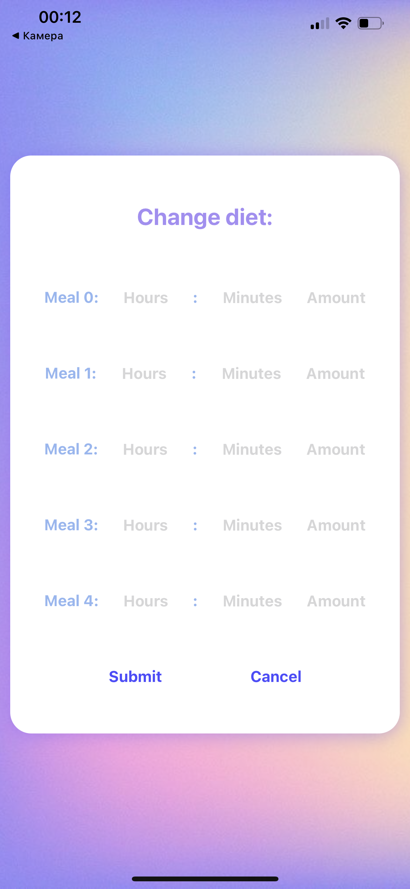

# Smart feeder mobile app with simulation in Unity

## Description
Mobile application with Expo tool for remote control of the pet feeder, with the function of tracking the history of feeding and notifications about the status of the feeder. The application has the ability to view the pet's current diet and, if necessary, change it. I focused mainly on creating an intuitive interface and using React Hooks.

Screenshots of the mobile application: 

  

  
  

  

  
  

  
  

  
  

Simulation in Unity: 

